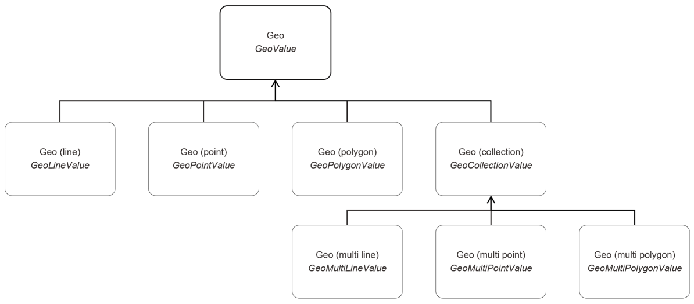

#  KNIME® - Geospatial Data Types

The KNIME Geospatial Data Types repository provides Geospatial data types for the KNIME Analytics Platform. These data types are available for node development in Java and Python. 

The code is organized as follows:

* org.knime.features.geospatial: The feature that bundles the Java and Python type plugins.
* org.knime.geospatial.core: The plugin that implements the Java type implementation.
* org.knime.geospatial.core.tests: The plugin that contains the unit tests for the Java type implementation.
* org.knime.geospatial.python: The plugin that contains the Python type implementation.
* org.knime.geospatial: This feature contains **experimental** Java based KNIME nodes which are not published anywhere.

## Geo Type Hierarchy

The Geospatial types are based on the [Well-known text representation (WKT)](https://en.wikipedia.org/wiki/Well-known_text_representation_of_geometry) and organized in a hierarchy. The following image depicts the hierarchy of the different types. Each node in the hierarchy has the name of the type as shown in the KNIME data table spec as well as the name of the corresponding class that implements the `DataValue` interface.

## Development

For more information on how to get started with the Python based development for KNIME Analytics Platform check out the [Create a New Python based KNIME Extension guide](https://docs.knime.com/latest/pure_python_node_extensions_guide/index.html).
Python code that uses the Geospatial data types can be found in the [Geospatial Analytics Extension for KNIME Git repository](https://github.com/spatial-data-lab/knime-geospatial-extension).

For more information on how to get started with the Java development for KNIME Analytics Platform have a look at the [Create a New Java based KNIME Extension guide](https://docs.knime.com/latest/analytics_platform_new_node_quickstart_guide/index.html).
Java based implementations that use the data types can be found in the `org.knime.geospatial` extension folder in this repository.

## Join the Community

* [KNIME Geospatial Forum](https://forum.knime.com/c/community-extensions/geospatial/)
